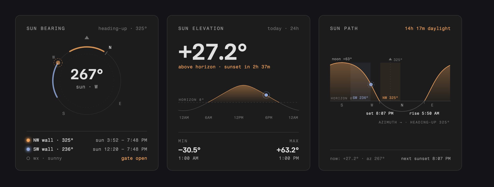
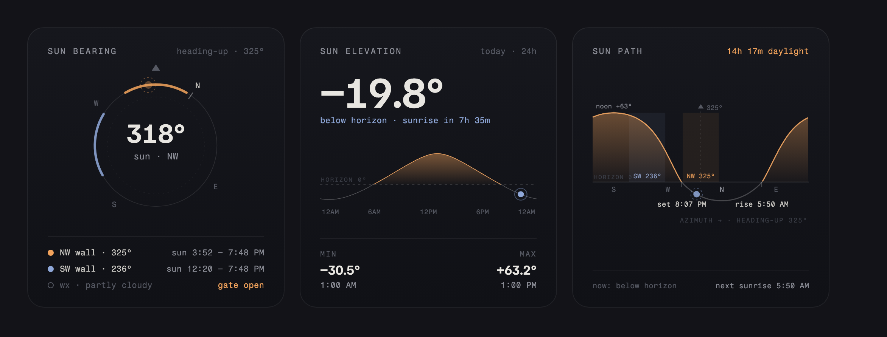

# Sun Cards · Observatory

Three custom Lovelace cards for Home Assistant that show where the sun is relative to your
house — a compass, an elevation chart, and a sun-path chart, drawn in a shared
"observatory" style.



By default the cards blend with your active HA theme. Prefer a self-contained dark look
instead? Set `use_theme_colors: false`:



| Card | Type | What it shows |
|---|---|---|
| **Bearing** | `custom:sun-cards-bearing` | Heading-up compass: sun position, wall arcs, sun-on-glass time windows, optional weather-gate status |
| **Elevation** | `custom:sun-cards-elevation` | Current elevation, 24 h curve with daylight highlight, min/max, sunrise/sunset countdown |
| **Path** | `custom:sun-cards-path` | Today's sun path (elevation vs azimuth, heading-up), wall bands, rise/set/noon markers |

All three are bundled in a single file with no dependencies. The full-day curves, rise/set
markers, min/max, and sun-on-glass windows are computed **in-card** from your Home Assistant
latitude/longitude (NOAA solar algorithm, ±2 min / ±0.3°). The *live* sun position comes from
`sun.sun` (or sensor overrides), so the cards update as HA does.

## Install (HACS)

1. HACS → three-dot menu → **Custom repositories**
2. Repository: `https://github.com/tkamenick/lovelace-sun-cards` · Type: **Dashboard**
3. Install **Sun Cards (Observatory)**, then reload your browser when prompted.

HACS registers the resource automatically. For manual installs, copy `sun-cards.js` to
`/config/www/` and add it as a dashboard resource (`/local/sun-cards.js`, JavaScript module).

## Shared options

| Option | Default | Description |
|---|---|---|
| `name` | per card | Header label |
| `sun_entity` | `sun.sun` | Source for live azimuth/elevation attributes and `next_rising`/`next_setting` |
| `azimuth_entity` | — | Optional sensor overriding azimuth (e.g. `sensor.sun_azimuth`) |
| `elevation_entity` | — | Optional sensor overriding elevation (e.g. `sensor.sun_elevation`) |
| `latitude` / `longitude` | HA location | Override the coordinates used for the day curves |
| `use_theme_colors` | `true` | Card surface, borders, and neutral text come from the active HA theme (works on light and dark themes); the amber/blue data accents stay. Set `false` for the self-contained Observatory look (dark gradient, 22px radius) |
| `load_fonts` | `true` | Load the design's Google Fonts (Familjen Grotesk / Fragment Mono). Set `false` for fully offline dashboards — falls back to system fonts |

In sections-layout dashboards all three cards default to the **same height** (6 grid rows) so
they line up side by side; the internals absorb any slack (the compass centers itself, charts
float, footers pin to the bottom). Resize any card via its layout options (`grid_options:
rows`) if you want a different height.

### `walls` (bearing + path cards)

```yaml
walls:
  - name: NW wall        # row label; first word is used on the path-card band
    bearing: 325         # wall-normal compass bearing, degrees
    color: "#f2a35c"     # optional, cycles orange/blue/... by default
    entity: cover.x      # optional — makes the wall row open this entity's more-info
```

| Option | Default | Description |
|---|---|---|
| `heading` | `325` | Compass bearing rendered "up" on the bearing compass and path chart |
| `wall_arc` | `60` | **Drawn** arc/band width in degrees (visual only) |

### Bearing card only

| Option | Default | Description |
|---|---|---|
| `sun_window` | `78` | Half-angle: sun is "on the glass" when its azimuth is within ±this of the wall bearing… |
| `min_elevation` | `3` | …and elevation is above this. Drives the per-wall time windows and the glowing dot |
| `weather_entity` | — | Weather entity for the gate row (e.g. `weather.kues`) |
| `bypass_entity` | — | `input_boolean`; when `on` the row shows **gate bypassed** |
| `sunny_conditions` | `[sunny, partlycloudy]` | Conditions that count as "gate open"; anything else shows **cloud hold** |

Note that `wall_arc` (what is drawn) is deliberately separate from `sun_window`/`min_elevation`
(what is computed): ±78° is nearly a full half-circle and would swamp the chart, so the drawn
arcs stay at a readable 60° while the time windows use the real automation rule.

## Example: 3-column sections view

See [examples/sun-shades-view.yaml](examples/sun-shades-view.yaml) for a complete sections-layout
view (one card per column) wired to real entities.

## Development

`dev/harness.html` renders all three cards against a mock `hass` object — serve the repo root
(`python3 -m http.server`) and open `/dev/harness.html`. Add `?t=HHMM` to stage the clock
(e.g. `?t=1730` for golden hour).

## License

MIT
