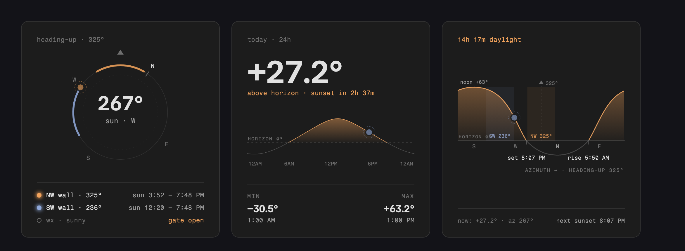
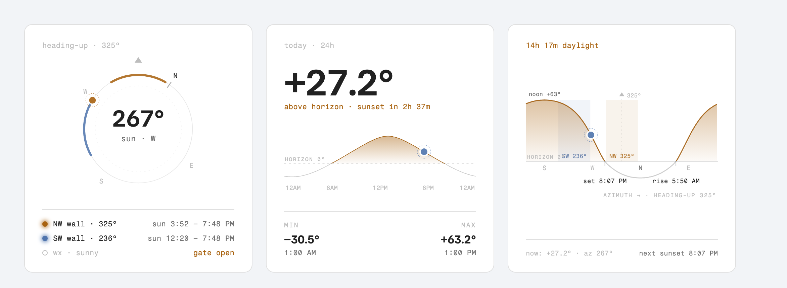

# Sun Cards

Three custom Lovelace cards for Home Assistant that show where the sun is relative to your
house — a compass, an elevation chart, and a sun-path chart, drawn in one shared style.



The cards take their surface, borders, and text colors from your active theme, and shift the
amber/blue data accents to deeper variants on light themes so everything stays readable:



| Card | Type | What it shows |
|---|---|---|
| **Bearing** | `custom:sun-cards-bearing` | Heading-up compass: sun position, wall arcs, sun-on-glass time windows, optional weather-gate status |
| **Elevation** | `custom:sun-cards-elevation` | Current elevation, 24 h curve with daylight highlight, min/max, sunrise/sunset countdown |
| **Path** | `custom:sun-cards-path` | Today's sun path (elevation vs azimuth, heading-up), wall bands, rise/set/noon markers |

All three are bundled in a single file with no dependencies. The full-day curves, rise/set
markers, min/max, and sun-on-glass windows are computed **in-card** from your Home Assistant
latitude/longitude (NOAA solar algorithm, ±2 min / ±0.3°). The *live* sun position comes from
`sun.sun` (or sensor overrides), so the cards update as HA does.

## Install (HACS)

1. HACS → three-dot menu → **Custom repositories**
2. Repository: `https://github.com/tkamenick/lovelace-sun-cards` · Type: **Dashboard**
3. Install **Sun Cards**, then reload your browser when prompted.

HACS registers the resource automatically. For manual installs, copy `sun-cards.js` to
`/config/www/` and add it as a dashboard resource (`/local/sun-cards.js`, JavaScript module).

## Shared options

| Option | Default | Description |
|---|---|---|
| `name` | — | Optional title in the card header. Omitted by default, since the cards read clearly on their own and a title usually just repeats the section heading above them |
| `sun_entity` | `sun.sun` | Source for live azimuth/elevation attributes and `next_rising`/`next_setting` |
| `azimuth_entity` | — | Optional sensor overriding azimuth (e.g. `sensor.sun_azimuth`) |
| `elevation_entity` | — | Optional sensor overriding elevation (e.g. `sensor.sun_elevation`) |
| `latitude` / `longitude` | HA location | Override the coordinates used for the day curves |
| `load_fonts` | `true` | Load the card fonts (Familjen Grotesk / Fragment Mono) from Google Fonts. Set `false` for fully offline dashboards — falls back to system fonts |

In sections-layout dashboards all three cards default to the **same height** (6 grid rows) so
they line up side by side; the internals absorb any slack (the compass centers itself, charts
float, footers pin to the bottom). Resize any card via its layout options (`grid_options:
rows`) if you want a different height.

The sun marker — a dot inside a dashed ring, with a knockout halo so it stays legible over
wall arcs and the day curve — is drawn at the same on-screen size in every card, at any card
width. Its color differs by card (amber on the compass, blue on the two charts) so it always
contrasts with the artwork underneath it.

### `walls` (bearing + path cards)

```yaml
walls:
  - name: NW wall        # row label; first word is used on the path-card band
    bearing: 325         # wall-normal compass bearing, degrees
    entity: cover.x      # optional — makes the wall row open this entity's more-info
    color: "#a8620f"     # optional — omit to follow the theme accent for this slot
```

Leave `color` out unless you want a specific hue: by default each wall takes the next theme
accent (amber, blue, green, pink), which keeps it readable on both light and dark themes.

| Option | Default | Description |
|---|---|---|
| `heading` | `325` | Compass bearing rendered "up" on the bearing compass and path chart |
| `wall_arc` | `60` | **Drawn** arc/band width in degrees (visual only) |

### Bearing card only

| Option | Default | Description |
|---|---|---|
| `sun_window` | `78` | Half-angle: sun is "on the glass" when its azimuth is within ±this of the wall bearing… |
| `min_elevation` | `3` | …and elevation is above this. Drives the per-wall time windows and the glowing dot |
| `weather_entity` | — | Weather entity for the gate row (e.g. `weather.kues`) |
| `bypass_entity` | — | `input_boolean`; when `on` the row shows **gate bypassed** |
| `sunny_conditions` | `[sunny, partlycloudy]` | Conditions that count as "gate open"; anything else shows **cloud hold** |

Note that `wall_arc` (what is drawn) is deliberately separate from `sun_window`/`min_elevation`
(what is computed): ±78° is nearly a full half-circle and would swamp the chart, so the drawn
arcs stay at a readable 60° while the time windows use the real automation rule.

## Example: 3-column sections view

See [examples/sun-shades-view.yaml](examples/sun-shades-view.yaml) for a complete sections-layout
view (one card per column) wired to real entities.

## Development

`dev/harness.html` renders all three cards against a mock `hass` object, on both a light and a
dark theme — serve the repo root (`python3 -m http.server`) and open `/dev/harness.html`.
Add `?t=HHMM` to stage the clock (e.g. `?t=1730` for golden hour) and `&row=dark|light` to
isolate one theme.

## License

MIT
